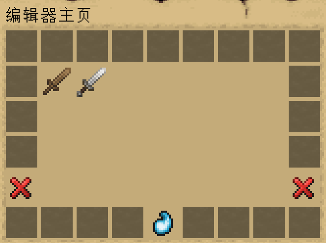
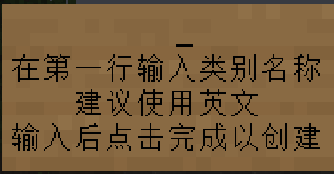
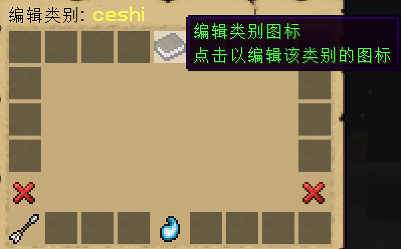

# 创建和编辑类别

## 简介

图鉴的所有条目都依赖于 **类别(category)** 这个概念, 同一个类别里的所有条目内部名称都必须是**独一无二**的.  
插件预设了一个**默认类别(default)**, 现在让我们创建我们自定义的第一个类别:  

## 创建类别

输入 `/yui edit` 以打开**编辑器主页**, 你将看到以下界面:  

点击最下面的`创建类别`按钮, 输入类别名称(建议**使用英文**)后点击完成.

  

至此, 你就成功创建了一个新类别了

## 编辑类别

当创建类别后, 你当然需要编辑这个类别的图标, 与刚才一样, 在**编辑器主页**中点击你刚刚创建的类别,  
点击顶部的`编辑类别图标`按钮:  

在图标按钮中你可以修改图标的以下相关内容:  
- 材质
- 名称
- 描述
- 是否闪烁
- CustomModelData
- 是否显示

在编辑完毕后, 记得要点击**保存类别图标**

