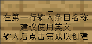

# 创建和编辑条目

## 简介

与类别不同的是，条目是图鉴的最小单位，而且它具有更复杂的属性.  
除了类别拥有的属性外, 它还具有:
- 归属类别
- 解锁条件

现在, 跟随本节, 你将会学习如何创建和编辑一个条目.

## 创建条目

在编辑器中, 进入你要编辑的类别, 点击`创建条目`按钮, 输入条目名称(建议**使用英文**)后点击完成

至此, 你就完成创建了一个新条目了.

## 编辑条目

与类别一样, 当创建条目后, 你当然需要编辑这个条目的图标, 与操作类别图标一样, 这里不过多赘述.  
我们主要讲述编辑条目的其他属性.

### 编辑条目奖励

目前的 `YuIllustration` 支持以下奖励类型:
- Kether Script
- 其他插件支持的奖励(MMOCore, MMOItems的属性)

你可在 [这里](./kether.md) 查看更多关于 Kether Script 的内容.

### 编辑条目解锁条件

条目解锁条件分为四种:
- NONE: 无解锁条件
- ITEM: 拾起指定物品
- EVENT: 触发指定事件
- BOTH: 同时满足 ITEM 和 EVENT

并且解锁条件只能选择一种.  
至于具体的配置, 在插件内 GUI 的解释已经很详细了, 这里不再过多赘述.