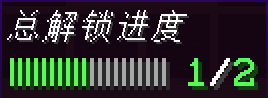

# 行内变量

插件提供了多种行内变量:

<details>
  <summary>变量列表</summary>

  ```scss
    {unlocked_
     ┗━ [category/total]} - 返回玩家已解锁对应category或总的条目数量
    {bar_
     ┗━ [category/total]} - 返回玩家已解锁对应category或总的条目bar
    {count_
     ┗━ [category/total]} - 返回对应category或总的条目数量
    {percent_
     ┗━ [category/total]} - 返回对应category或总的条目百分比
  ```
</details>

:::tip

但不幸的是，这些行内变量暂时都不可以在 **Entry/Category Icon** 上显示，只能在 **GUI Icon** 上显示

:::

## 使用

以下是一些变量使用的示例

```yaml title="main.yml"
icon-B:
  material: NAME_TAG
  name: '总解锁进度'
  lore:
    - '{bar-total} &a{unlocked-total}&f/&a{count-total}'
```

效果就是这样的:  
