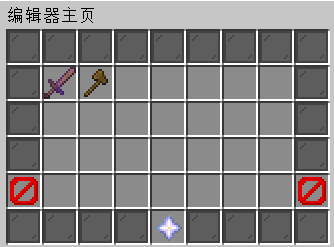
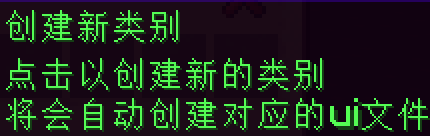
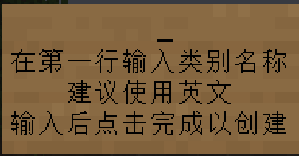
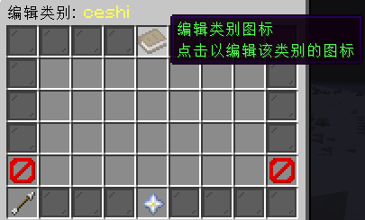

# Creating and Editing Categories

## Introduction

All entries in the encyclopedia depend on the concept of **categories (category)**, where all entry internal names within the same category must be **unique**.  
The plugin presets a **default category**, now let's create our first custom category:  

## Creating a Category

Enter `/yui edit` to open the **Editor Main Page**, where you'll see the following interface:  

Click on the `Create Category` button at the bottom, enter the category name (it's recommended to **use English**) and click finish.

  

By now, you have successfully created a new category.

## Editing a Category

After creating a category, you of course need to edit the icon for this category. Just like before, in the **Editor Main Page**, click on the category you just created,  
then click on the `Edit Category Icon` button at the top:  

In the icon button, you can modify the following related content of the icon:  
- Material
- Name
- Description
- Whether it blinks
- CustomModelData
- Whether to display

After editing, remember to click **Save Category Icon**

