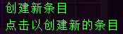
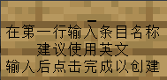

# Creating and Editing Entries

## Introduction

Different from categories, entries are the smallest unit of the encyclopedia and possess more complex attributes.  
In addition to the attributes of categories, entries also have:
- Belonging category
- Unlock conditions

Now, follow this section, and you will learn how to create and edit an entry.

## Creating an Entry

In the editor, enter the category you wish to edit, click the `Create Entry` button, enter the entry name (it's recommended to **use English**) and click finish.

By now, you have successfully created a new entry.

## Editing an Entry

Similar to categories, after creating an entry, you of course need to edit the icon for this entry. The operation is similar to editing a category icon, so it's not elaborated here.  
We'll mainly talk about editing other attributes of the entry.

### Editing Entry Rewards

The current version of `YuIllustration` supports the following reward types:
- Kether Script
- Rewards supported by other plugins (Attributes from MMOCore, MMOItems)

You can see more about Kether Script [here](./kether.md).

### Editing Entry Unlock Conditions

There are four types of entry unlock conditions:
- NONE: No unlock conditions
- ITEM: Pick up a specified item
- EVENT: Trigger a specified event
- BOTH: Satisfy both ITEM and EVENT conditions simultaneously

And only one unlock condition can be selected.  
As for the specific configuration, the explanations in the plugin's GUI are already very detailed, so they are not elaborated here.
